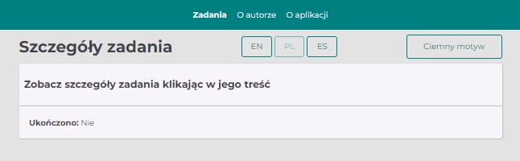
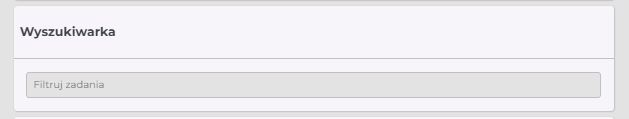
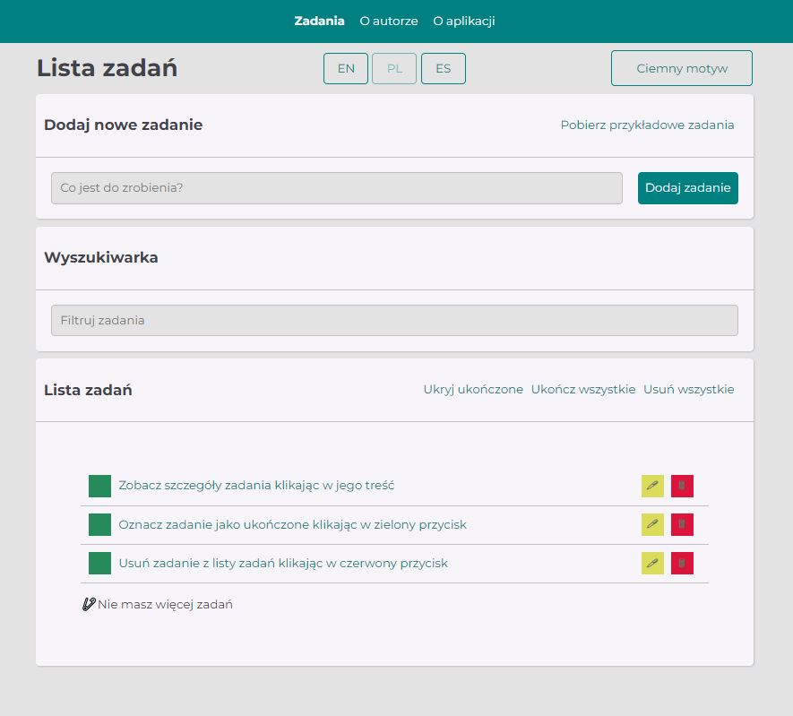
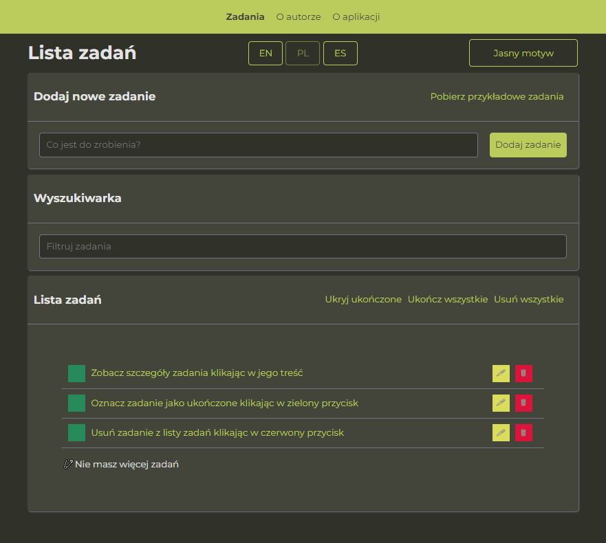

# 📂 To Do List - Lista zadań
This is a **multi-lingual** *To Do List* project.

You can choose one of **three availables languages**: EN, PL, ES.

This project was bootstrapped with Create React App.
# 📑 Table of contents:

1. [👁‍🗨Demo](#demo)
1. [📌Description](#description)
1. [👁‍🗨Web preview Light Theme](#web-preview-light-theme)
1. [👁‍🗨Web preview Dark Theme](#web-preview-dark-theme)
1. [🛠Technologies](#technologies)
1. [📌Available Scripts](#available-scripts)
## 👁‍🗨Demo:
[Add new task](https://maxnatalia.github.io/ToDoListReact/)
## 📌Description:

- This project contains:
    - adding a new task
    - ticking a task as done✅
    - editing a task
    - removing a task

- The project has been upgraded with new interesting features.

- Now you can also **hiding** completed tasks, quickly **unchecking** all already completed tasks and **removed** all tasks. Here you can see used **Modal** with two different versions for single task and all tasks. In addition, the application saves your tasks in **local storage**.

- You can also see **single task view**:

- Another improvement in this project is **changing theme**- what is also saved in **local storage** like changing languages.

- You can also **download example tasks** - (handled with redux-saga).

- Now, you can search your task using a **search engine**.

## 👁‍🗨Web preview Light Theme:

## 👁‍🗨Web preview Dark Theme:

## 🛠Technologies:

- [x] HTML
- [x] CSS (grid, media queries)
- [x] JavaScript
- [x] ES6+features
- [x] Markdown
- [x] Styled-Components
- [x] Create React App
- [x] React Hooks
- [x] React-Router
- [x] React-Redux
- [x] Redux-Saga
- [x] Redux-Toolkit
## 📌Available Scripts

In the project directory, you can run:

### `npm start`

Runs the app in the development mode.\
Open [http://localhost:3000](http://localhost:3000) to view it in your browser.

The page will reload when you make changes.\
You may also see any lint errors in the console.

### `npm run build`

Builds the app for production to the `build` folder.\
It correctly bundles React in production mode and optimizes the build for the best performance.

The build is minified and the filenames include the hashes.\
Your app is ready to be deployed!
